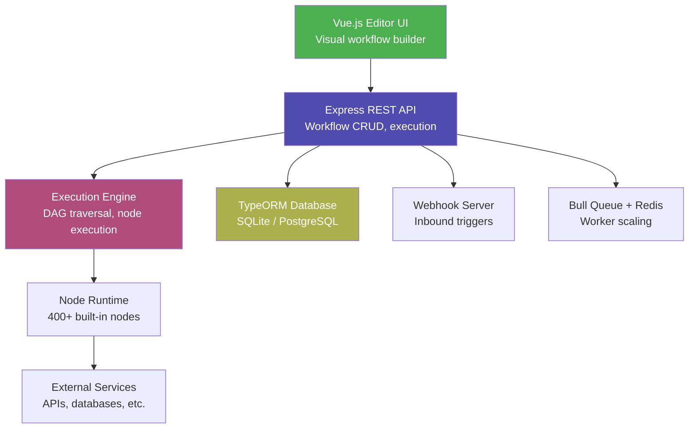
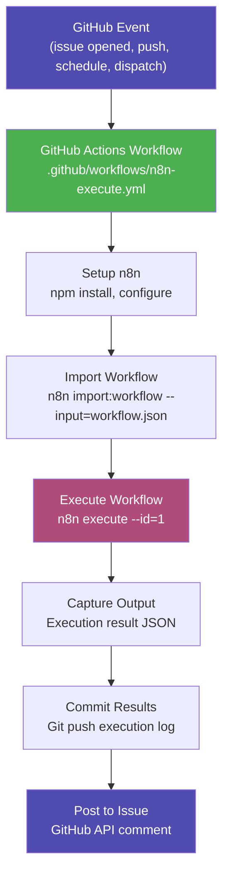

# Githubification Analysis: n8n Workflow Automation Platform

## Short Answer

Yes — n8n can be Githubified, and it is one of the most **architecturally interesting** candidates in the Githubification catalogue.

n8n is not a simple AI agent or a single-purpose tool. It is a **workflow automation platform** — a visual programming environment where users compose multi-step integrations from hundreds of pre-built nodes. Githubifying n8n means converting a server-based automation platform into something that runs entirely on GitHub Actions, using Issues as the user interface, Git as persistent storage, and GitHub Secrets for credential management.

This is a **Type 2 Githubification** (Non-AI Software Repo) with strong **Type 3 Hybrid** characteristics, because n8n already has deep GitHub integration (50+ operations in its GitHub node, 40+ webhook event types in its GitHub Trigger node) and a powerful CLI that supports headless execution.

---

## What n8n Is (Restated for Githubification Context)

n8n is an open-source workflow automation platform, written in TypeScript, structured as a monorepo of 40+ packages, and designed to run as a persistent server with a Vue.js visual editor. Users build workflows by connecting nodes — each node performs one operation (HTTP request, database query, AI inference, GitHub API call, etc.) — and these workflows execute as directed acyclic graphs (DAGs).

### Current Architecture (What Must Be Adapted)



### Key Properties for Githubification

| Property | Value | Impact on Githubification |
|----------|-------|---------------------------|
| **Language** | TypeScript (Node.js ≥22.16) | ✅ Runs natively on GitHub Actions runners |
| **Package manager** | pnpm | ✅ Available on Actions runners |
| **Database** | SQLite (dev) / PostgreSQL (prod) | ⚠️ SQLite works on ephemeral runners; PostgreSQL does not |
| **Execution model** | CLI `n8n execute --id=N` | ✅ Headless execution without server |
| **Workflow format** | JSON (nodes + connections) | ✅ Directly storable in Git |
| **Credential encryption** | AES-256 | ✅ Maps to GitHub Secrets |
| **Import/Export** | `n8n export:workflow --all --separate` | ✅ One JSON file per workflow, Git-friendly |
| **GitHub node** | 8 resources, 20+ operations | ✅ Native GitHub API access already built |
| **GitHub trigger** | 40+ webhook event types | ✅ Maps directly to `on:` triggers in Actions |
| **Webhook system** | Dynamic path routing, HMAC verification | ⚠️ Not available on ephemeral runners |
| **Worker/Queue mode** | Bull + Redis | ❌ Cannot run on Actions |
| **Visual editor** | Vue 3, requires server | ❌ Cannot run on Actions (but doesn't need to) |

---

## The Four Primitives Mapping

The Githubification invariant requires mapping the four GitHub primitives to n8n's architecture:

| GitHub Primitive | Githubification Role | n8n Mapping |
|---|---|---|
| **GitHub Actions** | Compute | Replaces the n8n server — workflows execute via `n8n execute` on an Actions runner |
| **Git** | Storage and memory | Workflow JSON files committed to the repo replace the database; execution logs committed as history |
| **GitHub Issues** | User interface | Replaces the Vue.js visual editor for triggering and interacting with workflows |
| **GitHub Secrets** | Credential store | Replaces n8n's AES-256 encrypted credential database; maps directly to `N8N_ENCRYPTION_KEY` + per-service secrets |

---

## What n8n Already Has (The Head Start)

n8n is unusually well-prepared for Githubification compared to most server-based software. Several capabilities already exist that reduce the implementation gap:

### 1. Headless CLI Execution

n8n can execute a workflow without starting the server:

```bash
n8n execute --id=5
```

This is the critical enabler. The execution engine, node runtime, and credential decryption all work in CLI mode. No web server, no editor, no Redis — just workflow execution.

### 2. JSON Workflow Import/Export

```bash
# Export all workflows as separate JSON files (Git-friendly)
n8n export:workflow --backup --output=./workflows/

# Import a workflow from a JSON file
n8n import:workflow --input=./workflows/my-workflow.json
```

Each workflow is a self-contained JSON document with `nodes`, `connections`, and `settings`. These files can be committed to Git, versioned, diffed, and reviewed in pull requests.

### 3. Native GitHub Integration (50+ Operations)

The existing `n8n-nodes-base.github` node supports:

| Resource | Operations |
|----------|-----------|
| **File** | create, delete, edit, get, list |
| **Issue** | create, createComment, edit, get, lock |
| **Repository** | get, getIssues, getLicense, getProfile, getPullRequests |
| **Release** | getAll |
| **Review** | create, dismiss, get, list, update |
| **Workflow** | dispatchAndWait, get, list, listRuns, triggerDispatch |
| **Organization** | getRepositories |
| **User** | getUserIssues, getRepositories |

This means n8n workflows can already manipulate GitHub Issues, PRs, files, releases, and even dispatch other GitHub Actions workflows — all from within a workflow node.

### 4. GitHub Trigger Node (40+ Events)

The `GithubTrigger` node already understands the full vocabulary of GitHub webhook events:

- `push`, `pull_request`, `issues`, `issue_comment`, `release`, `deployment`
- `check_run`, `check_suite`, `star`, `fork`, `create`, `delete`
- Security events: `repository_vulnerability_alert`, `security_advisory`
- Wildcard: `*` (any event)

In a Githubified context, these webhook events map directly to GitHub Actions `on:` trigger events.

### 5. Expression System

n8n's expression engine (`{{$json.field}}`, `{{$env["VAR"]}}`, `{{$credentials.token}}`) already supports environment variable access, which maps naturally to GitHub Actions environment variables and secrets.

### 6. SQLite Support

n8n's default database is SQLite, which runs as a file on disk. On an ephemeral Actions runner, SQLite works perfectly — the database file can be committed to Git or treated as disposable per-run state.

---

## Githubification Strategy: Hybrid (Type 2 + Type 3)

n8n does not fit cleanly into a single Githubification type. The recommended strategy is a **hybrid approach**:

### Layer 1 — Workflow Execution Engine (Type 2: Non-AI Software)

Run n8n's workflow execution engine on GitHub Actions without the server, editor, or database components. Users define workflows as JSON files in the repository. GitHub Actions triggers execute those workflows using the CLI.



### Layer 2 — AI Agent Interface (Type 3: Hybrid)

Add an AI agent (using the GitHub Minimum Intelligence pattern) that can:
1. Accept natural language instructions via GitHub Issues
2. Translate those instructions into n8n workflow JSON
3. Execute the workflow using Layer 1
4. Return results as issue comments

This creates a conversational automation interface where users describe what they want automated, and the AI agent builds and executes n8n workflows to accomplish it.

### Layer 3 — Self-Modifying Workflows (Advanced)

n8n workflows that create, modify, and manage other n8n workflows — stored as JSON in the repo, executed on Actions, with results committed back. The repo becomes a living automation platform.

---

## Concrete Implementation Architecture

### Repository Structure

```
.github/
  workflows/
    n8n-execute.yml                    # Core: execute n8n workflows on trigger
    n8n-schedule.yml                   # Scheduled workflow execution
    n8n-issue-dispatch.yml             # Issue-triggered workflow dispatch
    github-n8n-intelligence-agent.yml  # AI agent for conversational interface
  actions/
    setup-n8n/
      action.yml                       # Reusable action: install and configure n8n

workflows/                             # n8n workflow definitions (JSON)
  integrations/
    github-issue-triage.json           # Example: auto-triage issues
    pr-review-automation.json          # Example: automate PR reviews
    release-notes-generator.json       # Example: generate release notes
  utilities/
    data-transform.json                # Example: data processing
    notification-dispatch.json         # Example: multi-channel notifications

executions/                            # Execution logs (Git-tracked)
  latest/
  archive/

credentials/                           # Credential templates (no secrets)
  github-api.template.json
  slack-webhook.template.json

.github-n8n-intelligence/          # AI agent layer (GMI)
  .pi/
    skills/
      n8n-workflow-builder.md          # Skill: build n8n workflows from natural language
      n8n-executor.md                  # Skill: execute and monitor workflows
  lifecycle/
    agent.ts
  state/
```

### Core GitHub Actions Workflow (`n8n-execute.yml`)

```yaml
name: n8n Workflow Executor

on:
  workflow_dispatch:
    inputs:
      workflow_file:
        description: 'Path to n8n workflow JSON file'
        required: true
        type: string
      workflow_data:
        description: 'Optional input data (JSON string)'
        required: false
        type: string
  issues:
    types: [opened, labeled]
  issue_comment:
    types: [created]
  push:
    paths:
      - 'workflows/**/*.json'
  schedule:
    - cron: '0 */6 * * *'

permissions:
  contents: write
  issues: write

jobs:
  execute:
    runs-on: ubuntu-latest
    env:
      N8N_ENCRYPTION_KEY: ${{ secrets.N8N_ENCRYPTION_KEY }}
    steps:
      - uses: actions/checkout@v4

      - name: Setup Node.js
        uses: actions/setup-node@v4
        with:
          node-version: '22.x'

      - name: Install n8n
        run: npm install -g n8n

      - name: Configure credentials from secrets
        run: |
          # Map GitHub Secrets → n8n credential environment
          export GITHUB_TOKEN="${{ secrets.GITHUB_TOKEN }}"
          export OPENAI_API_KEY="${{ secrets.OPENAI_API_KEY }}"
          # Additional credential mapping as needed

      - name: Import workflow
        run: |
          n8n import:workflow --input="${{ inputs.workflow_file || 'workflows/default.json' }}"

      - name: Execute workflow
        id: execute
        run: |
          n8n execute --id=1 2>&1 | tee execution-output.log
          echo "status=$?" >> "$GITHUB_OUTPUT"

      - name: Save execution log
        run: |
          mkdir -p executions/latest
          cp execution-output.log "executions/latest/$(date -u +%Y-%m-%dT%H%M%SZ).log"
          git config user.name "n8n-bot[action]"
          git config user.email "n8n-bot[action]@users.noreply.github.com"
          git add executions/
          git commit -m "chore: save n8n execution log" || true
          git push || true

      - name: Post result to issue
        if: github.event_name == 'issues' || github.event_name == 'issue_comment'
        uses: actions/github-script@v7
        with:
          script: |
            const fs = require('fs');
            const log = fs.readFileSync('execution-output.log', 'utf8');
            const status = '${{ steps.execute.outputs.status }}' === '0' ? '✅' : '❌';
            await github.rest.issues.createComment({
              owner: context.repo.owner,
              repo: context.repo.repo,
              issue_number: context.issue.number,
              body: `## n8n Workflow Execution ${status}\n\n\`\`\`\n${log.slice(-2000)}\n\`\`\``
            });
```

### Reusable Setup Action (`setup-n8n/action.yml`)

```yaml
name: 'Setup n8n'
description: 'Install and configure n8n for GitHub Actions execution'
inputs:
  n8n-version:
    description: 'n8n version to install'
    default: 'latest'
  encryption-key:
    description: 'N8N_ENCRYPTION_KEY for credential decryption'
    required: true
runs:
  using: 'composite'
  steps:
    - name: Setup Node.js
      uses: actions/setup-node@v4
      with:
        node-version: '22.x'

    - name: Install n8n
      shell: bash
      run: npm install -g n8n@${{ inputs.n8n-version }}

    - name: Configure environment
      shell: bash
      run: |
        echo "N8N_ENCRYPTION_KEY=${{ inputs.encryption-key }}" >> "$GITHUB_ENV"
        echo "DB_TYPE=sqlite" >> "$GITHUB_ENV"
        echo "N8N_USER_FOLDER=${{ github.workspace }}/.n8n" >> "$GITHUB_ENV"
        mkdir -p "${{ github.workspace }}/.n8n"
```

---

## The Five Githubification Strategies Applied to n8n

Using the strategy selection guide from the Githubification playbook:

```
Does the agent exist yet?
└── n8n is not an agent — it's a workflow platform
    └── Can it run on GitHub Actions?
        └── Partially — CLI execution works, server does not
            └── Does it have a multi-channel/adapter architecture?
                └── No — but it has a plugin/node architecture
                    └── Strategy: Wrapping + Substitution hybrid
```

### Why Wrapping (Not Pure Substitution)

n8n's CLI execution mode (`n8n execute`) genuinely works on GitHub Actions runners. This is not a situation like Agent Zero where the runtime is fundamentally incompatible. The execution engine — which is the valuable part — runs headlessly. What doesn't work is:

| Component | Works on Actions? | Strategy |
|-----------|-------------------|----------|
| **Workflow execution** | ✅ Yes | Wrap — use `n8n execute` CLI |
| **Node runtime (400+ nodes)** | ✅ Yes | Wrap — nodes execute normally |
| **Credential decryption** | ✅ Yes | Wrap — AES-256 via `N8N_ENCRYPTION_KEY` secret |
| **SQLite database** | ✅ Yes | Wrap — ephemeral per-run, or committed to Git |
| **Workflow import/export** | ✅ Yes | Wrap — JSON files in Git |
| **Visual editor** | ❌ No | Substitute — use Issues + AI agent |
| **Persistent server** | ❌ No | Substitute — GitHub Actions replaces the server |
| **Webhook listener** | ❌ No | Substitute — GitHub Actions `on:` events replace webhooks |
| **Bull/Redis queue** | ❌ No | Substitute — Actions concurrency replaces the queue |

The result is a **Wrapping** strategy for the execution layer (the n8n engine runs as-is) with **Substitution** for the interaction layer (Issues + AI replace the visual editor).

---

## The GitHub Trigger Translation Table

n8n's GitHub Trigger node supports 40+ webhook events. Each maps to a GitHub Actions `on:` trigger:

| n8n GitHub Trigger Event | GitHub Actions `on:` Equivalent |
|---|---|
| `push` | `on: push` |
| `pull_request` | `on: pull_request` |
| `issues` | `on: issues` |
| `issue_comment` | `on: issue_comment` |
| `release` | `on: release` |
| `create` | `on: create` |
| `delete` | `on: delete` |
| `fork` | `on: fork` |
| `deployment` | `on: deployment` |
| `deployment_status` | `on: deployment_status` |
| `check_run` | `on: check_run` |
| `check_suite` | `on: check_suite` |
| `pull_request_review` | `on: pull_request_review` |
| `pull_request_review_comment` | `on: pull_request_review_comment` |
| `star` / `watch` | `on: watch` |
| `schedule` (cron via n8n) | `on: schedule` |
| `workflow_dispatch` (manual) | `on: workflow_dispatch` |
| `*` (wildcard) | Multiple `on:` entries |

This mapping is nearly 1:1 — n8n's trigger vocabulary and GitHub Actions' trigger vocabulary are almost identical. This makes the event-routing layer trivially thin.

---

## What n8n Gains from Githubification

### For Users

| Capability | Before (Server) | After (Githubified) |
|---|---|---|
| **Installation** | Docker, npm, database setup | Fork repo, add secrets |
| **Runtime** | Persistent server + database | GitHub Actions (zero infrastructure) |
| **Cost** | Server hosting ($5–100+/month) | Free tier (2,000 Actions minutes/month) or included in GitHub plan |
| **Trigger workflows** | Visual editor or API call | Open an issue, push code, label a PR, comment, or scheduled cron |
| **Version control** | Database-stored, manual export | Workflows are JSON in Git — every change versioned automatically |
| **Collaboration** | Share server access | Fork the repo — workflows are code |
| **Audit trail** | Execution logs in database | Execution logs committed to Git — immutable history |
| **Credential management** | n8n UI + encrypted database | GitHub Secrets — no separate credential store |
| **AI integration** | Add AI nodes to workflows | AI agent can build and execute workflows conversationally |

### For the n8n Ecosystem

1. **Distribution channel**: Every GitHub repository becomes a potential n8n deployment
2. **Workflow marketplace as Git**: Share workflows by sharing JSON files in repos, not by exporting/importing through a UI
3. **CI/CD integration**: n8n workflows become part of the CI/CD pipeline, triggered by the same events
4. **PR-based workflow review**: Workflow changes go through pull requests with review and approval

---

## Challenges and Mitigations

### Challenge 1: Execution Time Limits

GitHub Actions enforces a maximum 6-hour job timeout for public repositories (configurable for enterprise). Long-running workflows may exceed this.

**Mitigation**: n8n workflows are typically short (seconds to minutes). For long workflows, split into multiple jobs using `workflow_dispatch` chaining — one n8n workflow completes, dispatches the next.

### Challenge 2: No Persistent State Between Runs

GitHub Actions runners are ephemeral. The SQLite database and n8n user folder are lost after each run.

**Mitigation**:
- Commit workflow state to Git after each execution
- Use the `n8n import:workflow` command at the start of each run to rebuild state
- For complex state, use GitHub Actions artifacts or a lightweight state file in Git

### Challenge 3: No Inbound Webhooks

n8n's power comes partly from its webhook system — external services can push data to n8n. GitHub Actions runners cannot receive inbound HTTP requests.

**Mitigation**:
- Replace webhooks with polling (many n8n nodes support polling)
- Use `repository_dispatch` events — external services push events via GitHub API instead of direct webhooks
- For critical webhook use cases, maintain a thin webhook relay that converts webhooks to `repository_dispatch` events

### Challenge 4: Credential Management

n8n stores credentials encrypted with AES-256 in the database. In a Githubified context, there's no persistent database.

**Mitigation**:
- Map each n8n credential to a GitHub Secret
- At runtime, inject secrets as environment variables
- n8n already supports environment variable-based configuration for credentials
- The `N8N_ENCRYPTION_KEY` secret enables credential encryption/decryption in CLI mode

### Challenge 5: No Visual Editor

The Vue.js workflow editor cannot run on GitHub Actions. Users cannot visually build workflows.

**Mitigation** (three tiers):
1. **JSON-first**: Power users write workflow JSON directly (n8n's format is well-documented)
2. **Template library**: Pre-built workflow templates that users fork and customize
3. **AI agent**: The GMI layer translates natural language ("When a new issue is opened, label it and assign it to me") into n8n workflow JSON

### Challenge 6: Build Time and Size

n8n is a large monorepo. Full installation takes significant time and disk space.

**Mitigation**:
- Use `npm install -g n8n` (pre-built package) instead of building from source
- Cache the npm global directory using `actions/cache`
- Use the n8n Docker image as the runner base for fastest startup
- For minimal use cases, extract only the execution engine and required node packages

### Challenge 7: Concurrent Execution

GitHub Actions has concurrency limits per repository and organization.

**Mitigation**:
- Use `concurrency` groups to prevent conflicting executions
- Queue workflows using issue labels or a pending-execution state file
- For high-throughput needs, distribute across multiple repositories

---

## Comparison with Existing Githubified Repos

| Aspect | GMI (Native) | OpenClaw (Wrapping) | Agent Zero (Substitution) | **n8n (Hybrid)** |
|--------|-------------|---------------------|---------------------------|-----------------|
| **Lifecycle files** | 2 | 5 | 3 | **3–4** |
| **Runtime deps** | 1 (pi-coding-agent) | 30+ | 1 (pi-coding-agent) | **1 (n8n npm package)** |
| **New code** | None | Orchestration layer | Config + context | **Workflow templates + setup action** |
| **AI agent** | IS the agent | Not included | IS the substitute | **Optional GMI layer** |
| **Upstream compat** | N/A (born native) | Full (untouched source) | Full (untouched source) | **Full (n8n as npm dep)** |
| **Unique value** | Minimal agent | Complex agent on GitHub | GitHub access to incompatible agent | **Automation platform on GitHub** |

n8n's Githubification is unique in the catalogue because it brings not just one agent or tool to GitHub, but an **entire automation platform** — 400+ nodes, a DAG execution engine, and a workflow composition model. Every other Githubified repo does one thing. n8n does whatever its workflows are configured to do.

---

## Implementation Phases

### Phase 1 — Minimal Viable Githubification (MVP)

**Goal**: Execute a pre-defined n8n workflow on GitHub Actions via `workflow_dispatch`.

**Deliverables**:
- [ ] `setup-n8n` reusable action (install n8n, configure environment)
- [ ] `n8n-execute.yml` workflow (dispatch → import → execute → log)
- [ ] One example workflow JSON (e.g., `workflows/hello-world.json`)
- [ ] Execution log committed to `executions/`
- [ ] Documentation: how to add secrets, how to trigger

**Validates**: n8n CLI execution works on GitHub Actions runners.

### Phase 2 — Event-Driven Execution

**Goal**: Trigger n8n workflows from GitHub events (issue opened, push, PR, schedule).

**Deliverables**:
- [ ] Event-to-workflow routing (map GitHub events to n8n workflow files)
- [ ] `n8n-issue-dispatch.yml` (issue events → n8n workflow)
- [ ] `n8n-schedule.yml` (cron → n8n workflow)
- [ ] Result posting to Issues (execution output as comment)
- [ ] Workflow templates for common GitHub automation tasks

**Validates**: GitHub events can drive n8n workflow execution.

### Phase 3 — AI Agent Layer (GMI Integration)

**Goal**: Users describe automations in natural language; the AI agent builds and executes n8n workflows.

**Deliverables**:
- [ ] GMI installation (`.github-n8n-intelligence/`)
- [ ] `n8n-workflow-builder` skill (natural language → workflow JSON)
- [ ] `n8n-executor` skill (execute and monitor workflows)
- [ ] Conversational workflow creation via Issues
- [ ] Workflow review and modification via Issue comments

**Validates**: The AI-as-interface pattern works for workflow automation.

### Phase 4 — Workflow Marketplace and Sharing

**Goal**: Share, discover, and compose n8n workflows across repositories.

**Deliverables**:
- [ ] Workflow catalogue format (metadata, descriptions, required secrets)
- [ ] Cross-repo workflow dispatch (trigger workflows in other repos)
- [ ] Workflow composition (one workflow triggers another)
- [ ] Template repository for quick Githubified n8n setup

**Validates**: The Githubified n8n model scales across organizations.

---

## The Core Insight

n8n's architecture has an accidental but powerful alignment with Githubification:

> **n8n workflows are JSON documents that describe executable graphs. Git stores documents. GitHub Actions executes workflows. The mapping is natural.**

Most Githubification candidates require significant translation between their native execution model and GitHub's primitives. n8n is different because:

1. **Workflows are already data** (JSON), not compiled binaries or running services
2. **Execution is already headless** (`n8n execute` CLI), not server-dependent
3. **Triggers are already event-driven** (webhook events ≈ GitHub Actions events)
4. **Credentials are already secret-based** (encrypted store ≈ GitHub Secrets)
5. **Output is already structured** (JSON execution results), not streaming or interactive

The impedance mismatch is remarkably low for a system of this complexity. The visual editor is the main casualty — but an AI agent interface via Issues may actually be a *more powerful* interaction model for many automation use cases.

---

## Decision

**Recommended strategy**: Hybrid (Wrapping for execution + Substitution for interface)

**Difficulty**: Medium — n8n's CLI mode does most of the heavy lifting; the main work is orchestration scaffolding and credential mapping.

**Estimated effort**:
- Phase 1 (MVP): 1–2 days
- Phase 2 (Event-driven): 3–5 days
- Phase 3 (AI layer): 5–7 days
- Phase 4 (Marketplace): Ongoing

**Unique position in the catalogue**: n8n would be the first **platform** Githubification — not just one agent or tool running on GitHub, but a general-purpose automation engine that can execute arbitrary workflows composed from 400+ integration nodes. If Githubification turns every repo into an execution environment, n8n turns every repo into an **automation platform**.

