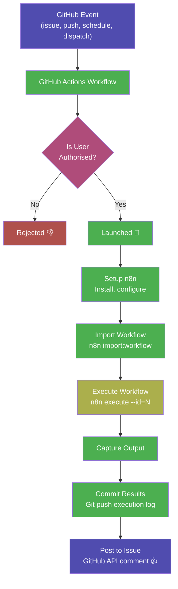

# GitHub n8n Intelligence

A Githubified n8n workflow automation platform powered by the GitHub Minimum Intelligence framework. Runs n8n's 400+ integration nodes entirely on GitHub Actions, uses Issues for conversation, Git for persistent storage, and GitHub Secrets for credential management.

### Please read [this](docs/final-warning.md) before you install this AI Agent.

## Installation

1. Copy [`.github/workflows/github-n8n-intelligence-agent.yml`](../.github/workflows/github-n8n-intelligence-agent.yml) into your repo's `.github/workflows/` directory.
2. Add the LLM API key `OPENAI_API_KEY` as a **repository secret** under **[Settings → Secrets and variables → Actions]**. Any [supported LLM provider](#supported-providers) can work but to quick start OpenAI GPT 5.4 is pre-configured.
3. Go to **[Actions → github-n8n-intelligence-agent → Run workflow]** to install the agent files automatically, subsequent runs perform upgrades.
4. Open an issue — the agent will reply.

<p align="center">
  <picture>
    
  </picture>
</p>

## n8n on GitHub — Workflow Automation Without Servers

[](https://opensource.org/licenses/MIT) 

This repository brings n8n's powerful workflow automation engine to GitHub's native infrastructure. Instead of hosting a server, n8n workflows are JSON files in Git, executed headlessly on GitHub Actions runners, with results committed back to the repository.

Powered by [pi-mono](https://github.com/badlogic/pi-mono), conversation history is committed to git, giving your agent long-term memory across sessions. It can search prior context, edit or summarize past conversations, and all changes are versioned.

---

## What This Does

n8n is a workflow automation platform with 400+ built-in integration nodes. This project runs it entirely on GitHub:

| Before (Server) | After (Githubified) |
|---|---|
| Docker, npm, database setup | Fork repo, add secrets |
| Persistent server + database | GitHub Actions (zero infrastructure) |
| Server hosting ($5–100+/month) | Free tier (2,000 Actions minutes/month) |
| Visual editor or API call | Open an issue, push code, or scheduled cron |
| Database-stored, manual export | Workflows are JSON in Git — versioned automatically |
| Share server access | Fork the repo — workflows are code |

---

## The Four Primitives

| GitHub Primitive | Role | n8n Mapping |
|---|---|---|
| **GitHub Actions** | Compute | Replaces the n8n server — workflows execute via `n8n execute` on an Actions runner |
| **Git** | Storage | Workflow JSON files committed to repo replace the database; execution logs committed as history |
| **GitHub Issues** | User interface | Replaces the Vue.js visual editor for triggering and interacting with workflows |
| **GitHub Secrets** | Credentials | Replaces n8n's AES-256 encrypted credential database |

---

## How It Works

The system operates as a closed loop inside your GitHub repository:



---

## AI Agent Layer

The AI agent (powered by GitHub Minimum Intelligence) adds a conversational interface:
- **Describe automations in natural language** → the agent builds n8n workflow JSON
- **Ask about existing workflows** → the agent explains what they do
- **Request modifications** → the agent edits workflow files directly
- **Monitor executions** → the agent reports results from execution logs

### Key Concepts

| Concept | Description |
|---|---|
| **Issue = Conversation** | Each GitHub issue maps to a persistent AI conversation. Comment again to continue where you left off. |
| **Git = Memory** | Session transcripts are committed to the repo. The agent has full recall of every prior exchange. |
| **Actions = Runtime** | GitHub Actions is the only compute layer. No servers, no containers, no external services. |
| **Workflows = JSON in Git** | n8n workflow definitions are versioned JSON files — diffable, reviewable, forkable. |

---

## Project Structure

```
.github/
  workflows/
    github-n8n-intelligence-agent.yml  # AI agent workflow
    n8n-execute.yml                        # n8n workflow executor
    fetch-n8n-templates.yml                # Fetch n8n community templates
  actions/
    setup-n8n/
      action.yml                           # Reusable action: install and configure n8n

workflows/                                 # n8n workflow definitions (JSON)
  integrations/
    github-issue-triage.json               # Example: auto-triage issues
  utilities/
    hello-world.json                       # Example: hello world test
  templates/                               # Official n8n community templates
    catalog.json                           # Searchable index of all templates
    0042_Send_Slack_message_on_new_star.json
    …                                      # 400+ workflow template files

scripts/
  fetch-n8n-templates.mjs                  # Fetch all templates from n8n.io API

executions/                                # Execution logs (Git-tracked)

credentials/                               # Credential templates (no secrets)
  github-api.template.json
  slack-webhook.template.json

.github-n8n-intelligence/              # AI agent layer (GMI)
  .pi/
    skills/
      n8n-workflow-builder/                # Skill: build n8n workflows from natural language
      n8n-executor/                        # Skill: execute and monitor workflows
      memory/                              # Skill: search and recall past sessions
  lifecycle/
    agent.ts                               # Core agent orchestrator
  state/                                   # Session history and issue mappings
  AGENTS.md                                # Agent identity file
  VERSION                                  # Installed version
  package.json                             # Runtime dependencies
```

---

## Configuration

**Change the model** — edit `.github-n8n-intelligence/.pi/settings.json`:

<details>
<summary><strong>OpenAI - GPT-5.4 (default)</strong></summary>

```json
{
  "defaultProvider": "openai",
  "defaultModel": "gpt-5.4",
  "defaultThinkingLevel": "high"
}
```

Requires `OPENAI_API_KEY`.
</details>

<details>
<summary><strong>Anthropic</strong></summary>

```json
{
  "defaultProvider": "anthropic",
  "defaultModel": "claude-opus-4-6",
  "defaultThinkingLevel": "high"
}
```

Requires `ANTHROPIC_API_KEY`.
</details>

<details>
<summary><strong>Google Gemini</strong></summary>

```json
{
  "defaultProvider": "google",
  "defaultModel": "gemini-2.5-pro",
  "defaultThinkingLevel": "medium"
}
```

Requires `GEMINI_API_KEY`.
</details>

<details>
<summary><strong>xAI - Grok</strong></summary>

```json
{
  "defaultProvider": "xai",
  "defaultModel": "grok-3",
  "defaultThinkingLevel": "medium"
}
```

Requires `XAI_API_KEY`.
</details>

<details>
<summary><strong>DeepSeek (via OpenRouter)</strong></summary>

```json
{
  "defaultProvider": "openrouter",
  "defaultModel": "deepseek/deepseek-r1",
  "defaultThinkingLevel": "medium"
}
```

Requires `OPENROUTER_API_KEY`.
</details>

---

## Supported Providers

| Provider | `defaultProvider` | Example model | API key env var |
|----------|-------------------|---------------|-----------------|
| OpenAI | `openai` | `gpt-5.4` (default), `gpt-5.3-codex` | `OPENAI_API_KEY` |
| Anthropic | `anthropic` | `claude-sonnet-4-20250514` | `ANTHROPIC_API_KEY` |
| Google Gemini | `google` | `gemini-2.5-pro`, `gemini-2.5-flash` | `GEMINI_API_KEY` |
| xAI (Grok) | `xai` | `grok-3`, `grok-3-mini` | `XAI_API_KEY` |
| DeepSeek | `openrouter` | `deepseek/deepseek-r1` | `OPENROUTER_API_KEY` |
| Mistral | `mistral` | `mistral-large-latest` | `MISTRAL_API_KEY` |
| Groq | `groq` | `deepseek-r1-distill-llama-70b` | `GROQ_API_KEY` |

---

## n8n Workflow Template Library

The repository automatically captures the full n8n community workflow template library (400+ workflows) from [n8n.io/workflows](https://n8n.io/workflows).

### How It Works

The **Fetch n8n Workflow Templates** action (`fetch-n8n-templates.yml`) runs `scripts/fetch-n8n-templates.mjs`, which:

1. Queries the n8n templates API to discover every published workflow template.
2. Downloads each complete workflow definition (nodes, connections, settings).
3. Saves each workflow as a JSON file in `workflows/templates/`.
4. Writes `workflows/templates/catalog.json` — a searchable index of every template.

### Triggering a Fetch

```bash
# Manual — fetch all new templates (resume mode)
gh workflow run fetch-n8n-templates.yml

# Manual — full re-fetch
gh workflow run fetch-n8n-templates.yml -f resume=false
```

The action also runs automatically every **Sunday at 04:00 UTC**.

### Using Templates

Any template can be executed directly:

```bash
gh workflow run n8n-execute.yml -f workflow_file=workflows/templates/0042_Send_Slack_message_on_new_star.json
```

---

## n8n Execution

### Running a Workflow

```bash
# Trigger via GitHub Actions
gh workflow run n8n-execute.yml -f workflow_file=workflows/utilities/hello-world.json

# Or add the n8n-execute label to an issue
```

### Adding New Workflows

1. Create a workflow JSON file in `workflows/`
2. Follow the n8n workflow format (nodes + connections)
3. Commit and push — the workflow is now available for execution

### Credential Management

Map each n8n credential to a GitHub Secret:

| n8n Credential | GitHub Secret | Purpose |
|---------------|--------------|---------|
| N8N_ENCRYPTION_KEY | `N8N_ENCRYPTION_KEY` | Decrypt n8n credentials |
| GitHub API Token | `GITHUB_TOKEN` | GitHub API access (automatic) |
| Slack Webhook | `SLACK_WEBHOOK_URL` | Slack notifications |

---

## Security

The workflow only responds to repository **owners, members, and collaborators**. Random users cannot trigger the agent on public repos.

If you plan to use this for anything private, **make the repo private**. Public repos mean your conversation history and workflow definitions are visible to everyone.

---

<p align="center">
  <picture>
    
  </picture>
</p>
